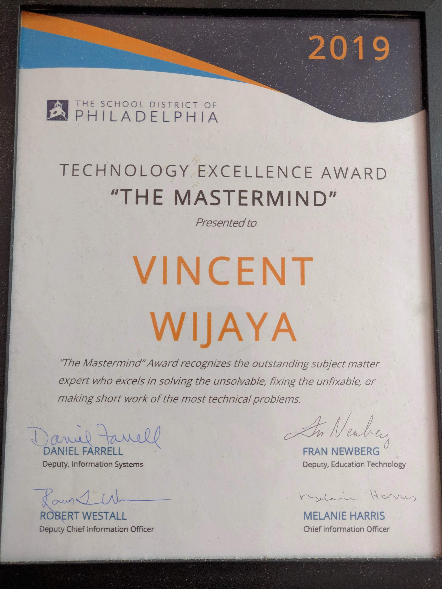
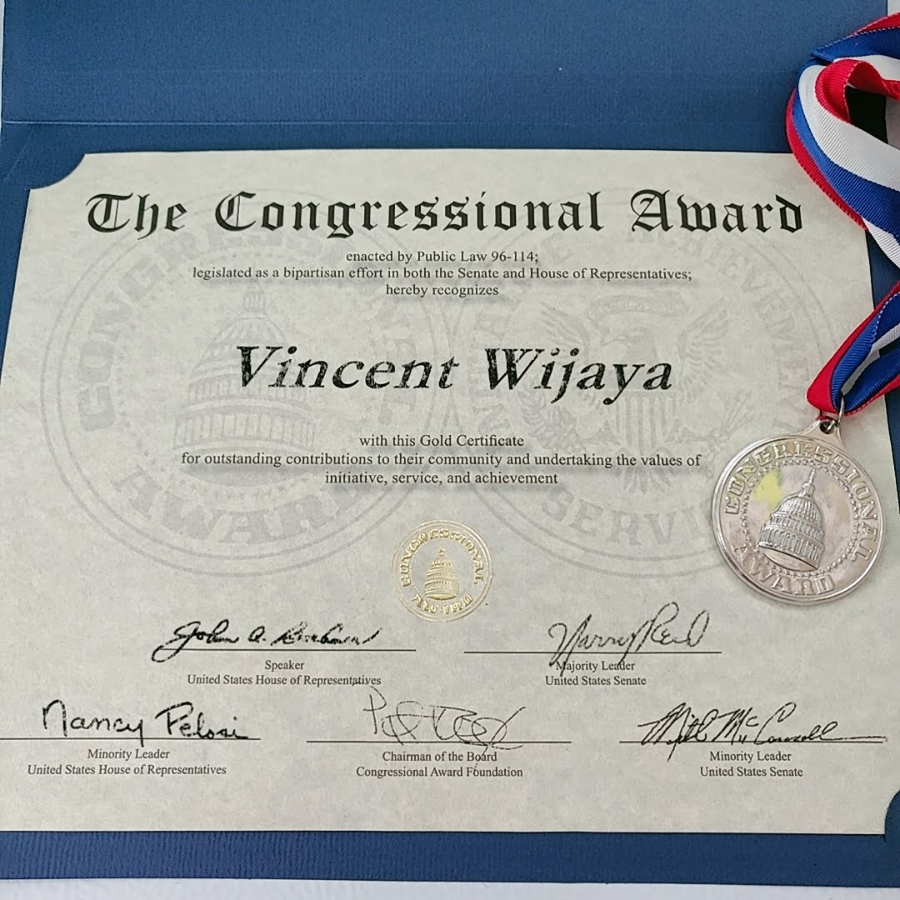

#   Education
**Temple University**
Bachelor of Science in Computer Engineering

### Coursework:

- Digital Communications
- Stochastic Processes
- Signal: Continuous & Discreet
- Control & Embedded Systems
- Microprocessors & Digital Circuit 
- Data Structure & Abstraction
- [Matlab, Verilog, Assembly, Java, C, Ubuntu LTS Linux]

### Certification:

- CompTIA A+
- CompTIA Network+
- AWS Cloud Practitioner 

#  Experience

**School District, Greater Philadelphia Area**
*Network/Technical Support Specialist*

- Handles mid-sized to complex projects related to maintenance, administration, and securement of highly technical LAN environment, network server, and distributed application
- Serves as an expert in identification, prioritization, and resolution of facility issues along with industry-standard applications
- Acts as a senior liaison to lead problem resolution activities as well as working cohesively with technical operations, and network support engineers

**Ricoh**
*IT Operation Analyst*

- Collaborate with engineering and Dev-Ops team to develop and provision virtualized server environments 
- Manage regional database to effectively align and support (IoT) initiatives
- Addresses a wide range of complex hardware, software, network, and A/V technology issues

**Capital One**
*Sys Admin Intern*

- Deploy scalable scripts that automates database backup and detects corrupted user profile
- Evaluate cost justification for LAN/WAN solutions
- Improved the overall network infrastructure by providing comprehensive, on-site technical support services

**Kulicke & Soffa**
*System Analyst Intern*

- Drive the adoption of latest technology models which supports agile and micro-service based architectures
- Perform extensive PCB stress test of digital circuits to assure its structural integrity
- Benchmark tools and processes to propel d2d operations cadence

[*Download copy of My Resume (under construction)*](
http://)
{: .text-center}

{:height="50%" width="50%"}
{:height="50%" width="50%"}

